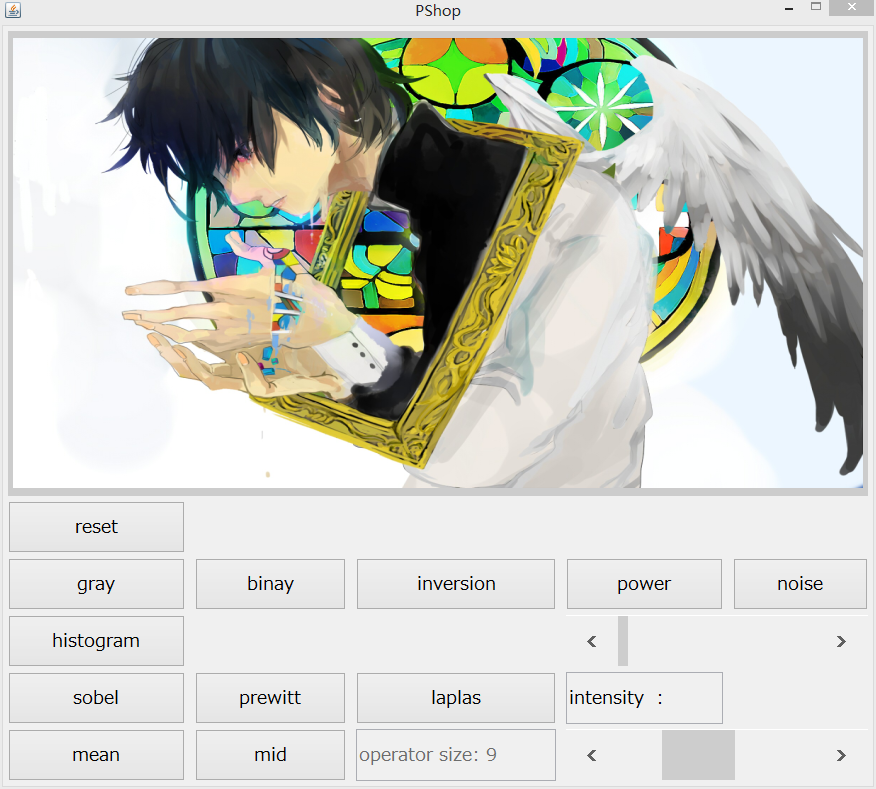

# PShop
Digital image processing program by java swing

***

PShop is a program for beginners in digital image processing.  
The program implements some basic algorithms when you enter this field,   
like gray-scale transformation, histogram equalization and edge detection.  
Hope you like it.

## Screenshots 
  
/ [More here](screenshots)

> If you have any problem, please contact hevlhayt@foxmail.com (ﾉﾟ▽ﾟ)ﾉ
